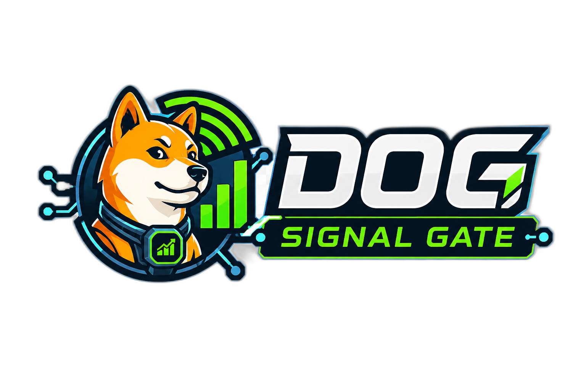

<h1 align="center">DogSignal Gate Strategy Lab</h1>

<p align="center">
  <a href="https://terrydengbin-glitch.github.io/dog-signal-gate-home/">
    
  </a>
</p>

<p align="center">
  <strong>Dog Signal Gate 开源智能交易体系的 Strategy Lab 层：策略验证、沙盒实验、回测回放、模拟盘和交易质量数据沉淀入口。</strong>
</p>

<p align="center">
  <a href="https://terrydengbin-glitch.github.io/dog-signal-gate-home/">Dog Signal Gate 官网</a>
  ·
  <a href="https://github.com/terrydengbin-glitch/rag_mcp">Knowledge MCP</a>
  ·
  <a href="https://github.com/terrydengbin-glitch/Strategy-Lab">Strategy Lab</a>
  ·
  <a href="https://github.com/terrydengbin-glitch/ai_traders">AI Trader</a>
</p>

## Dog Signal Gate 开源体系

Dog Signal Gate 是一个面向智能交易、量化研究和交易工程的开源共建体系。它希望把单人研究变成多人协作，把零散脚本变成可验证系统，把策略经验、失败复盘、数据契约、风控规则和 AI 训练流程沉淀成可以持续复用的工程资产。

Dog Signal Gate 不追求无法验证的神秘信号，而是追求可复现、可归因、可审计、可持续迭代的研究流程。真正有价值的 Alpha 应该经得起成本、滑点、流动性、样本外验证、模拟盘和受控实盘的检验。

Strategy Lab 是 Dog Signal Gate 开源智能交易体系中的 **策略研究与验证层**。

它不追求无法验证的神秘信号，也不让 LLM 直接下单。它的职责是在策略想法和 AI Trader 之间建立一条可复现、可审计、可比较的数据与实验链路：生成候选信号，跑回测、回放、模拟盘和沙盒实验，沉淀 Trade Quality 归因，并导出可供 AI Trader 训练和校准的候选交易数据。

```text
市场数据 / K 线 / micro context
        -> 策略信号与 trade plan
        -> 风控 / Trade Gate
        -> paper-equivalent backtest / replay / paper simulation
        -> Trade Quality 归因
        -> candidate ledger / training sidecar DB
        -> AI Trader scoring / calibration / final gate
```

核心体系分为三层：

| 层级 | 项目 | 职责 |
| --- | --- | --- |
| 01 | Knowledge MCP | 沉淀交易工程、AI Engineering、回测审计、风控治理和持续学习知识 |
| 02 | Strategy Lab | 策略沙盒、回测、回放、模拟盘、Trade Quality 归因和训练数据生成 |
| 03 | AI Trader | 候选信号评分、校准、确定性 Final Gate、LLM 审计助手和发布治理 |

本仓库是第二层：**Strategy Lab**。

Strategy Lab 负责生成和验证策略候选机会。AI Trader 则读取 Strategy Lab 产生的 candidate ledger、执行证据、known-at 特征和质量标签，训练不同策略自己的 AI 决策器，学习哪些机会更值得执行。

## 项目价值

很多策略在单次回测里看起来很好，但进入模拟盘或实盘前会遇到几个典型问题：

- 参数只在某个小区间表现好，离开样本后失效。
- 回测、回放、模拟盘和实盘链条不一致，导致结果不能比较。
- 只记录真实成交订单，不记录被拒绝或未执行的候选机会，训练样本存在幸存者偏差。
- 只看 PF、胜率或收益，缺少开仓前市场状态、成本、滑点、MFE、MAE、holding time 和失败原因。
- AI 模型直接参与交易决策，缺少校准、阈值、审计、人工审批和回滚治理。

Strategy Lab 解决的是 **策略验证和交易数据沉淀**，不是神秘信号生成。

它把策略研发从“某次回测结果不错”推进到“可复现、可审计、可持续学习的策略实验系统”：

- 用沙盒快速测试策略、参数、交易对和时间窗口。
- 用 paper-equivalent 链条让回测、回放和模拟盘结果尽量字段级可比较。
- 用 candidate ledger 同时记录 executable order 和 rejected plan order。
- 用 Trade Quality 在 close / exit 后补齐训练所需答案。
- 用 training sidecar DB 隔离训练数据，不污染主业务运行 DB。
- 为 AI Trader 提供候选信号、决策时特征、执行结果、质量标签和 source lineage。

## 在体系中的位置

Strategy Lab 不替代 AI Trader，也不负责模型训练和最终 AI Gate。

```text
Knowledge MCP
  提供交易工程、策略审计、数据治理、AI 训练约束等上下文

Strategy Lab
  生成候选信号，跑策略实验、回测、回放、模拟盘和 Trade Quality

AI Trader
  读取 Strategy Lab 数据，训练 scorer，做校准、threshold policy 和 deterministic final gate
```

Strategy Lab 输出的是可验证的实验资产和训练数据资产；AI Trader 在这些资产之上做候选机会评分和交易质量门控。

## 核心能力

### 1. 市场数据与信号流水线

Strategy Lab 可以构建交易对 universe，抓取 Binance futures light snapshot，扫描候选信号，路由 micro target，组装 factor snapshot，并生成 trade plan。

典型前段链路：

```text
build-universe
fetch-futures-light-snapshot
scan
route-micro-targets
assemble-factor-snapshot
apply-direction-gate
apply-final-decisions
```

### 2. 多策略实验线

项目内包含多条策略和证据链：

- K 线策略研究。
- Strategy 4 observe flow。
- Strategy 5 / Strategy 6 evidence 和 replay flow。
- `without_micro`、`micro_fast`、`micro_full` 三种策略链路。
- trade plan line 生成和审计。

项目支持 microstructure 相关代码，但实验也可以明确限定为纯 K 线策略，不强制引入 microstructure。

### 3. Paper-Equivalent 回测 / 回放

Strategy Lab 的一个关键原则是：

```text
回测、回放、模拟盘和实盘结果不能因为策略名称相同就视为等效。
```

只有当下面这些环节走同一真实链条，或者有字段级映射和差异报告证明等效时，结果才可比较：

```text
信号生成
数据可用时间 / known-at
事件时钟
风控 / Trade Gate 检查
订单意图
成交 / 成本 / 延迟模型
订单状态机
仓位 / 账户同步
审计日志
```

因此，Strategy Lab 把 paper-equivalent execution 作为严肃回测和 replay 的基础。

### 4. Strategy Sandbox

沙盒模块用于隔离实验上下文，避免覆盖 baseline 运行数据。

支持的执行模式：

- `baseline`：正常主业务运行路径。
- `ui_sandbox`：从 Vue3 控制台选中的沙盒上下文。
- `cli_sandbox`：外部 CLI 调用的研究 lane。

沙盒 run 需要显式携带上下文：

```text
sandbox_id
run_id
cycle_id
source_mode
resource_lane
```

沙盒输出会落到对应 sandbox runtime 目录，不应该覆盖主链条 `DATA/` 下的 baseline 运行产物。

### 5. Candidate Ledger

Strategy Lab 不只记录 executable order，也支持记录被拒绝或阻断的 plan order。

Candidate ledger 的目标是让训练数据覆盖：

- 通过 Trade Gate 并进入 executable order 的候选机会。
- 被规则、风控或 gate 阻断的候选机会。
- rejected candidate 的 counterfactual paper-equivalent outcome。
- gate reason、feature snapshot、source refs 和 leakage-safe label。

这可以减少只学习成交订单带来的样本偏差。

### 6. Trade Quality

Trade Quality 是 close / exit 后的交易质量分析模块，不应该用简单模拟标签替代。

Trade Quality 可能包含：

- realized PnL / R multiple
- PF contribution
- fee / slippage
- MAE / MFE
- holding time
- stop-loss / take-profit 行为
- entry / exit 市场状态
- winner / loser 等质量标签
- reason code 和 root-cause 风格诊断

对下游 AI 训练来说，Trade Quality 给出了“这笔候选交易最终质量如何”的答案。

### 7. Training Sidecar DB

Strategy Lab 会把训练数据和主业务运行 DB 隔离。

核心边界：

- 不为了训练修改主 paper DB。
- 不把 AI 训练产物写进 live/runtime ledger。
- 明确 `source_mode`：`baseline`、`ui_sandbox`、`cli_sandbox`。
- 明确 source refs：source DB path、source table、source row id、timestamp、hash。
- 遵守 known-at policy：decision-time input 不能包含 post-trade outcome。

训练导出可以包含：

- `trade_snapshot_events`
- entry / exit snapshot
- candidate ledger rows
- gate decisions
- cost context
- Trade Quality label
- source refs
- dataset manifest

AI Trader 负责后续 dataset split、Unit 注册、模型训练、校准、threshold policy 和 Final Gate 治理。

## 仓库结构

```text
laoma_signal_engine/
  api/                    FastAPI app 和 runtime read service
  audit/                  run-level 与业务链审计
  backtest/               paper-equivalent backtest / replay
  context/                funding / OI / basis context provider
  core/                   config、IO、time、symbol 等公共工具
  decision/               direction gate、risk gate、trade plan
  factors/                factor snapshot 组装
  llm/                    DeepSeek 辅助审计解释
  market/                 universe、snapshot、REST budget、liquidity
  micro/                  micro daemon、OFI/CVD、bucket、quality
  notifications/          Feishu 通知集成
  paper/                  paper engine、storage、daemon、fill model
  scanner/                candidate scanner
  strategy4/              Strategy 4 observe path
  strategy5/              Strategy 5 evidence path
  strategy6/              Strategy 6 evidence path
  strategy_sandbox/       sandbox service、resource governor、writer context
  trade_quality/          Trade Quality engine 和 diagnostics
  training_readiness/     training manifest 和 readiness helpers
  universe/               Binance universe 和 manual watchlist
scripts/                  运维、审计、replay 和阶段脚本
tools/                    本地 focused runner
reuse_scripts/            可复用市场 / micro 计算脚本
web/                      Vue3 runtime dashboard
```

公开仓库不包含本地运行数据：

```text
DATA/
BACKUPS/
logs/
runtime_logs/
*.db
*.sqlite
*.log
```

## 安装

Python 版本：

```text
Python >= 3.11
```

基础安装：

```bash
python -m venv .venv
source .venv/bin/activate
pip install -r requirements.txt
pip install -e .
```

Windows PowerShell：

```powershell
python -m venv .venv
.\.venv\Scripts\Activate.ps1
pip install -r requirements.txt
pip install -e .
```

检查 CLI：

```bash
python -m laoma_signal_engine --help
```

## 常用命令

运行默认 pipeline：

```bash
python -m laoma_signal_engine run --mode once --stdout-json
```

运行 baseline pipeline：

```bash
python -m laoma_signal_engine run-pipeline --stdout-json
```

运行包含 micro wait 的 pipeline：

```bash
python -m laoma_signal_engine run-pipeline-with-micro --micro-wait-until-ready --stdout-json
```

构建交易对 universe：

```bash
python -m laoma_signal_engine build-universe --force
```

抓取 futures light snapshot：

```bash
python -m laoma_signal_engine fetch-futures-light-snapshot
```

扫描候选信号：

```bash
python -m laoma_signal_engine scan --stdout-json
```

沙盒命令：

```bash
python -m laoma_signal_engine sandbox --help
```

启动 FastAPI：

```bash
uvicorn laoma_signal_engine.api.app:app --reload --host 127.0.0.1 --port 8000
```

## Vue3 控制台

前端目录：

```bash
cd web
npm install
npm run dev
```

默认开发地址：

```text
http://127.0.0.1:5173/
```

控制台用于观察 runtime state、sandbox context、策略输出、paper 状态、pipeline health 和 audit 相关视图。

## 环境变量

复制 `.env.example` 为 `.env` 后配置本地环境变量。

```text
DEEPSEEK_API_KEY=
DEEPSEEK_BASE_URL=https://api.deepseek.com
DEEPSEEK_MODEL=deepseek-v4-pro
```

真实密钥不要提交到 Git。`.env` 已被忽略。

LLM 只用于审计解释、字段检查和结构化报告，不参与最终交易门控。

## 测试

Python 语法检查：

```bash
python -m compileall -q laoma_signal_engine scripts tools reuse_scripts
```

运行测试：

```bash
python -m pytest
```

前端构建：

```bash
npm --prefix web run build
```

部分 integration / manual 测试需要真实网络、Binance endpoint、运行期数据或沙盒 artifact，应当按实验目的单独运行。

## 与 AI Trader 的边界

Strategy Lab：

- 生成候选信号和 trade plan。
- 执行回测、回放和 paper simulation。
- 生成 candidate ledger、paper ledger、Trade Quality 和 training sidecar export。
- 保留 known-at 和 source lineage。
- 不训练或发布 AI Trader Unit。

AI Trader：

- 读取 Strategy Lab 导出的数据。
- 训练 Numeric Scorer。
- 做 probability calibration 和 threshold policy。
- 执行 deterministic final gate。
- 使用 LLM 做审计解释。
- 管理 Unit Pool、模型版本、release readiness 和 controlled-live governance。

## 硬边界

```text
LLM 不直接下单。
LLM 不覆盖确定性风控和 Final Gate。
回测、回放、模拟盘和实盘必须链条等效才可比较。
decision-time feature 必须遵守 known-at policy。
post-trade outcome 不能泄漏到模型输入。
runtime DB 和 training sidecar DB 必须隔离。
训练数据需要记录 rejected candidate，避免只学习成交订单。
进入 live 必须有单独审批、kill-switch、rollback 和 risk governance。
```

## 当前状态

Strategy Lab 是一个活跃研发中的交易工程项目。当前公开仓库包含代码、测试、脚本、前端和配置，用于本地检查和运行；不包含本地交易数据库、私有报告、沙盒产物、日志和生成的数据集。

当前已覆盖的核心模块包括：

- Binance futures universe 和 light snapshot pipeline。
- candidate scanning 和 factor assembly。
- direction gate、risk gate 和 trade plan generation。
- Strategy 4 / 5 / 6 research evidence path。
- PaperEngine 和 paper-equivalent backtest。
- Strategy sandbox service 和 isolated writer context。
- Candidate ledger 和 training-readiness export helpers。
- Trade Quality diagnostics。
- FastAPI service 和 Vue3 dashboard。

## 风险提示

本项目用于交易系统研发、回测、模拟盘和数据质量实验，不构成投资建议。任何策略、模型、评分、gate 或报告，都必须经过成本、滑点、流动性、样本外验证、模拟盘和受控风险限制检验后，才能考虑进入真实资金环境。

## 开源共建

Dog Signal Gate 不希望把交易研究藏在黑箱里，而是希望把链路变成可检查、可复盘、可持续迭代的工程系统：

```text
idea -> experiment -> evidence -> quality attribution -> dataset -> AI gate -> audit -> controlled deployment
```

欢迎贡献：

- 策略实验和失败复盘。
- backtest / paper 等效性审计。
- candidate ledger 和 known-at 数据契约。
- Trade Quality 指标和诊断。
- sandbox 和 resource governor 优化。
- FastAPI / Vue3 控制台体验。
- 外部回测、模拟盘和 AI Trader connector。

你可以从很小的地方开始：改一段文档、补一个测试、整理一个 schema、增加一个审计报告，都会让这个开源交易研究栈更可靠。
